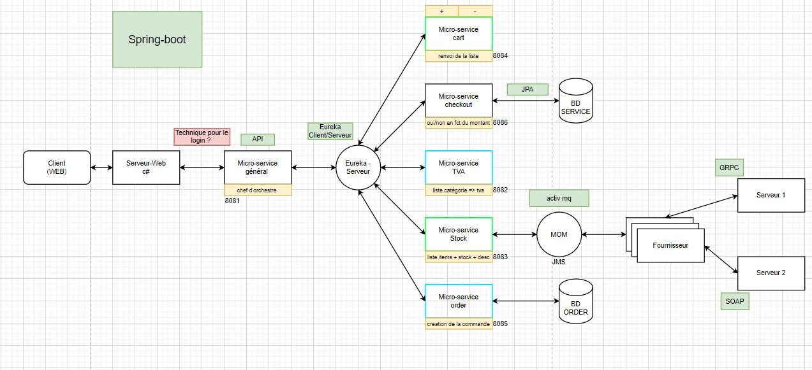

# Laboratoire systèmes distribués final

#### Service de shopping en micro services

#### Architecture proposée au prof et acceptée

La partie GRPC et SOAP sont **optionnels** selon le temps restant. 

#### micro-service GENERAL

| fonctionnalité      | requête (url)                                              | note                                                         | micro-service source                  |
| :------------------ | ---------------------------------------------------------- | ------------------------------------------------------------ | ------------------------------------- |
| getAllSellableItems | http://localhost:8080/items/                               | -                                                            | micro-service **stock**               |
| addItemToCart       | http://localhost:8080/cart/add/{user}/{item}/{quantity}    | ne retourne rien pour le moment                              | micro-service **cart**                |
| removeItemFromCart  | http://localhost:8080/cart/remove/{user}/{item}/{quantity} | ne retourne rien pour le moment                              | micro-service **cart**                |
| getUsersCart        | http://localhost:8080/cart/get/{user}                      | -                                                            | micro-service **cart**                |
| previewCommand      | http://localhost:8080/command/preview/{user}               | valide le cart -> renvoi une commande à valider              | micro-service **order**               |
| ValidateCommand     | http://localhost:8080/command/checkout/{Commandid}         | valide la commande et retire l'argent de l'utilisateur **+** renvoi un objet message avec u | micro-service **order** + **checkou** |
| CheckUsersCommand   | http://localhost:8080/command/list/{userName}              |                                                              | micro-service **order**               |
| ??? **LOGIN**       | ???                                                        | ???                                                          | ???                                   |

#### micro-service TVA

| fonctionnalité        | requête (url)         | note                                          |
| -------------- | ----------------------------------------- | --------------------------------------------------------- |
| getListTvaAndCategory | http://service/       |                                               |
| getTvaByCategory      | http://service/{type} | renvoi de catégorie **autre** en cas d'erreur |

#### micro-service STOCK

| fonctionnalité | requête(url)                              | note                                                      |
| -------------- | ----------------------------------------- | --------------------------------------------------------- |
| getAllItems    | http://service/items/                     |                                                           |
| getItemDetails | http://service/items/{item-id}            |                                                           |
| getStockOfItem | http://service/stock/{item-id}/{quantity} | réponse similaire au précédent + boolean de disponibilité |
| ??             | ??                                        | un moyen de retirer du stock ?                            |

 

#### micro-service CART

| fonctionnalité | requête (url)                                        | note                   |
| -------------- | ----------------------------------------- | --------------------------------------------------------- |
| addItem        | http://service/cart/add/{user}/{itemId}/{quantity}    | pas de corps en retour |
| removeItem     | http://service/cart/remove/{user}/{itemId}/{quantity} | pas de corps en retour |
| listItems      | http://service/cart/list/{user}                       |                        |

**AJOUTER LE RESTE DES MICRO-SERVICES**

